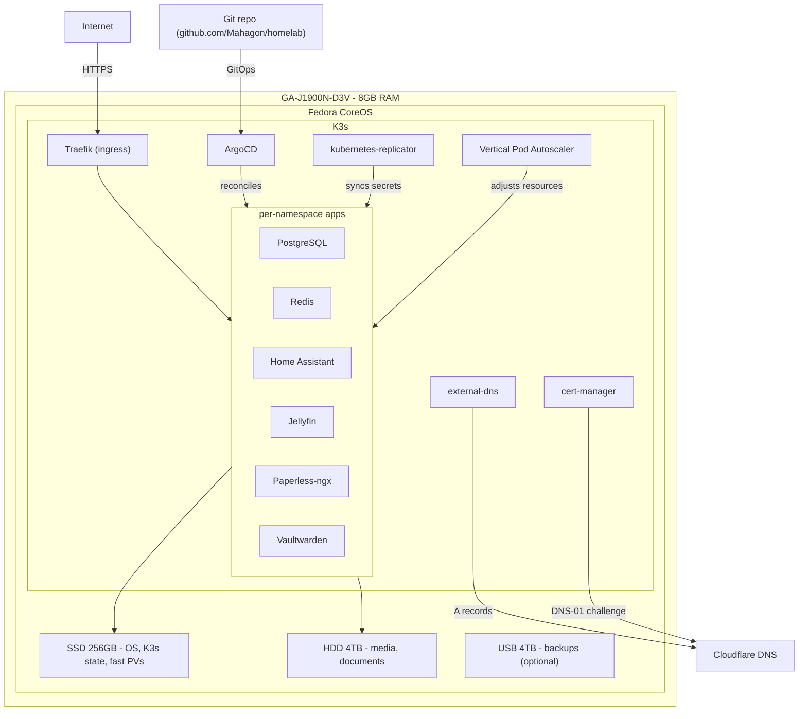
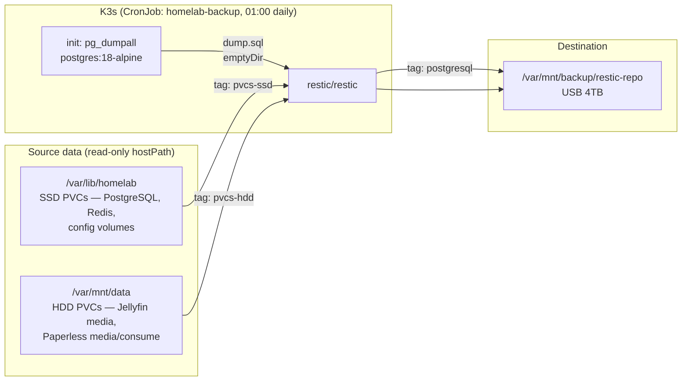

# Homelab - Fedora CoreOS + K3s + ArgoCD

Declarative home lab running on a GA-J1900N-D3V (8GB RAM, 256GB SSD, 4TB HDD).

## Architecture



## Prerequisites

- USB flash drive for FCOS installation
- Cloudflare account + API token (Zone:DNS:Edit + Zone:Zone:Read permissions)
- kubectl + helm CLI
- A workstation on the same network

## Setup Order

### 1. Install Fedora CoreOS

**Transpile the Butane config to Ignition:**

```bash
# Add your SSH public key to butane/config.bu first, then:
podman run --interactive --rm \
  quay.io/coreos/butane:release \
  --pretty --strict < butane/config.bu > butane/config.ign
```

**Create a bootable USB stick:**

```bash
# Download the latest stable FCOS ISO
podman run --privileged --rm \
  -v .:/data -w /data \
  quay.io/coreos/coreos-installer:release \
  download -s stable -p metal -f iso

# Write the ISO to your USB stick (replace /dev/sdX - double-check with lsblk!)
sudo dd if=fedora-coreos-*.iso of=/dev/sdX bs=4M status=progress oflag=sync
```

**Install to disk:**

1. Boot the machine from the USB stick (live environment)
2. Set keyboard layout if needed (e.g. German layout):

   ```bash
   sudo loadkeys de
   ```

3. Serve the Ignition file from your workstation:

   ```bash
   # Open port 8080 through the firewall temporarily
   sudo firewall-cmd --add-port=8080/tcp

   python3 -m http.server 8080  # run in the butane/ directory
   ```

4. Verify the target drive (look for your 256GB SSD):

   ```bash
   lsblk -o NAME,SIZE,MODEL,TRAN
   ```

5. If the disk has existing LVM volumes, deactivate them first:

   ```bash
   sudo vgchange -an
   ```

6. On the booted machine, install to the SSD (replace `sda` if needed):

   ```bash
   sudo coreos-installer install /dev/sda \
      --insecure-ignition \
     --ignition-url http://<workstation-ip>:8080/config.ign
   ```

7. Close the firewall port on your workstation:

   ```bash
   sudo firewall-cmd --remove-port=8080/tcp
   ```

8. Reboot - K3s installs automatically on first boot via the `install-k3s.service` unit

### 2. Generate SSH key for ArgoCD repo access

The bootstrap script uses `~/.ssh/id_ed25519_argocd` to give ArgoCD read access to this repo.
Run the following on your **workstation** (not the homelab) to generate the key pair:

```bash
ssh-keygen -t ed25519 -C "argocd@homelab" -f ~/.ssh/id_ed25519_argocd
```

Then add the public key as a deploy key on GitHub (`github.com/Mahagon/homelab`):

1. Go to **Settings → Deploy keys → Add deploy key**
2. Paste the contents of `~/.ssh/id_ed25519_argocd.pub`
3. Name it `argocd-homelab`, leave **Allow write access** unchecked
4. Click **Add key**

> Leave the passphrase empty - ArgoCD reads the key automatically and cannot prompt for one.

### 3. Bootstrap ArgoCD

```bash
ssh core@<your-server-ip>
# K3s is auto-installed via Ignition - verify:
sudo systemctl status k3s

# From your workstation, copy the kubeconfig:
scp core@<server-ip>:/etc/rancher/k3s/k3s.yaml ~/.kube/config
# Fix the server address in the kubeconfig

# Bootstrap ArgoCD + secrets.
# The script will prompt for GitHub OAuth credentials for ArgoCD and Paperless-ngx.
cd k8s/bootstrap/
DOMAIN=example.com EMAIL=you@example.com REPO_URL=git@github.com:Mahagon/homelab.git \
  ./install-argocd.sh
```

### 4. Deploy the App-of-Apps

```bash
kubectl apply -f k8s/apps/app-of-apps.yaml
# ArgoCD will now reconcile all applications
```

Secrets are handled automatically - no manual secret creation needed after bootstrap:

- **mittwald/kubernetes-secret-generator** generates random passwords on first sync
- **kubernetes-replicator** pushes the PostgreSQL and Redis passwords to app namespaces

DNS records are created automatically by external-dns once it starts.

### 5. Run Tests

```bash
cd tests/
pip install -r requirements.txt
HOMELAB_DOMAIN=example.com pytest -v
```

## Storage Layout

| Mount              | Disk | StorageClass     | Purpose                                       |
| ------------------ | ---- | ---------------- | --------------------------------------------- |
| `/`                | SSD  | -                | Fedora CoreOS root (read-only)                |
| `/var`             | SSD  | -                | K3s state, container images, ArgoCD           |
| `/var/lib/homelab` | SSD  | `local-path-ssd` | Fast PVs: PostgreSQL, Redis, config volumes   |
| `/var/mnt/data`    | HDD  | `local-path-hdd` | Bulk PVs: Jellyfin media, Paperless documents |
| `/var/mnt/backup`  | USB  | -                | Backup target (optional, nofail mount)        |

## Backup

Daily incremental backups via restic at 01:00 (before the Zincati update window on Sunday 03:00–05:00).



**Retention policy:** 7 daily · 4 weekly · 6 monthly snapshots per tag.

**Restore a snapshot:**

```bash
# List snapshots
kubectl run restic-restore --rm -it --restart=Never \
  --image=restic/restic:latest \
  --env="RESTIC_REPOSITORY=/backup/restic-repo" \
  --env="RESTIC_PASSWORD=<password-from-secret>" \
  --overrides='{"spec":{"volumes":[{"name":"backup","hostPath":{"path":"/var/mnt/backup"}}],"containers":[{"name":"restic-restore","image":"restic/restic:latest","command":["restic","snapshots"],"volumeMounts":[{"name":"backup","mountPath":"/backup"}]}]}}' \
  -- restic snapshots

# Get restic password
kubectl get secret restic-credentials -n backup -o jsonpath='{.data.password}' | base64 -d
```

## Service URLs (after deployment)

| Service        | URL                                    |
| -------------- | -------------------------------------- |
| ArgoCD         | `https://argocd.<your-domain>`         |
| Home Assistant | `https://homeassistant.<your-domain>`  |
| Jellyfin       | `https://jellyfin.<your-domain>`       |
| Paperless-ngx  | `https://paperless.<your-domain>`      |
| Vaultwarden    | `https://vault.<your-domain>`          |
| PostgreSQL     | Internal only (ClusterIP on port 5432) |
| Redis          | Internal only (ClusterIP on port 6379) |
